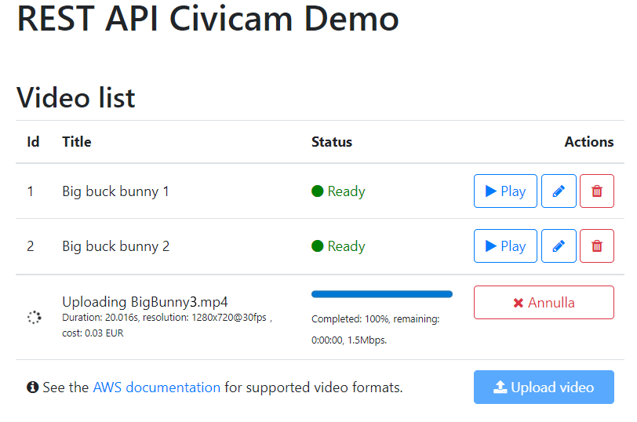

# Demo Application for Civicam REST API
This application demonstrates how to use the Civicam REST API to upload, edit and remove videos.



## Getting started
First, you'll have to paste the administrative Api Key provided by the Halleymedia dev team in the [index.html file here](index.html#L149). Alternatively, you can create a new file `ApiKey.txt` and paste it in there.

This is a simple ES6 JavaScript application that must be run in a browser. You can host it in your own webserver or, if you have Node installed, it might be quicker to just run these commands and then open the address [http://localhost:3000](http://localhost:3000)
```
npm install
npm run serve
```
## Points of interest

* The [./Services/Client.js](./js/Services/Client.js) file contains some sample methods used to invoke operations on the Civicam REST API. Please note how the API Key is provided to the service, [here](./js/Services/Client.js#L122);
* The [./js/App.js](./js/App.js) and [./js/Services/Uploader.js](./js/Services/Uploader.js) files show the workflow needed to upload a video file.
  * First, let the user pick a video file;
  * [Detect its features](./js/App.js#L111), such as width, height and duration and [send them to the REST API](./js/App.js#L119) so it can make an estimate of the upload and transcode costs;
  * Optionally, [let the user approve the estimate](./js/App.js#L122) and then [make a request the REST API](./js/App.js#L128) in order to get the AWS S3 bucket and object key informations you should upload the file to;
  * [Use the Evaporate.js](./js/Services/Uploader.js#L28) library to upload the video file in chunks. It can [report progress](./js/Services/Uploader.js#L44). Make it [send out a request to the REST API](./js/Services/Uploader.js#L98) so it can let it sign the canonical request to AWS;
  * When the upload completes, the client application has completed its job. The video will be transcoded remotely and it will be made available for playback as soon as it finishes. The [source property](./js/Models/Video.js#L34) of the video response will be non null when the video is ready to be played.